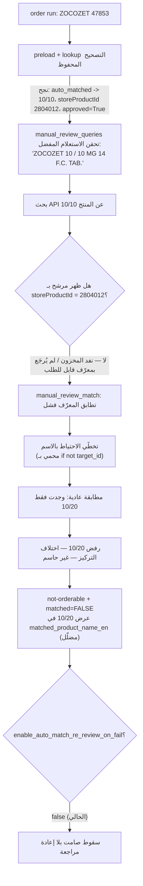

# تقرير: عدم تطبيق التصحيح المحفوظ لصنف ZOCOZET أثناء `order run`

**تاريخ التقرير:** 2026-06-24
**كود الصنف:** `47853`
**اسم الصنف (Excel):** `ZOCOZET 10MG/10MG  14TAB`
**التصحيح المحفوظ يوجّه إلى:** `ZOCOZET 10 / 10 MG 14 F.C. TAB.`
**ما ظهر في الملخص:** `ZOCOZET 10 / 20 MG 14 F.C. TAB.`

---

## 1. المشكلة كما وصفها المستخدم

عند تشغيل `order run`، الصنف `ZOCOZET 10MG/10MG  14TAB` ظهر في تقرير آخر تشغيل مرتبطاً
بصنف آخر هو `ZOCOZET 10 / 20 MG 14 F.C. TAB.`، رغم أنه سبق تصحيحه يدوياً في
**Saved Corrections (Manual Review Store)** ليُطابق `ZOCOZET 10 / 10 MG 14 F.C. TAB.`.

سؤال إضافي: هل تُحذف أصناف من **Saved Corrections** من قاعدة البيانات بطريقة غير مقصودة؟

---

## 2. الإجابة المباشرة (الخلاصة)

1. **النظام لم يطلب الصنف الخاطئ فعلياً.** الحالة كانت `not-orderable` و`matched = FALSE`،
   أي لم تتم إضافة أي صنف للسلة. الاسم `ZOCOZET 10 / 20 MG` ظهر فقط كـ«مرشّح تشخيصي»
   في عمود عرض مضلِّل، ولم يُسجَّل كطلب.
2. **التصحيح المحفوظ طُبِّق فعلاً** (تم العثور عليه وحَقن اسمه كاستعلام بحث مُفضّل)، لكنه
   **لم يُكرَم** لأن المنتج المصحَّح `ZOCOZET 10 / 10 MG` **نفد من المخزون** فلم يُرجِعه
   البحث بمعرّف قابل للطلب.
3. **لا يوجد حذف تلقائي غير مقصود.** تصحيح ZOCOZET ما زال موجوداً في قاعدة البيانات
   (تم تأكيده بقراءة مباشرة). لكن يوجد خطران على سلامة البيانات يجب إصلاحهما (القسم 7).

---

## 3. الأدلة القاطعة

### 3.1 قراءة مباشرة من قاعدة البيانات (CockroachDB) — القرار موجود ولم يُحذف

```
key                       = ('47853', 'ZOCOZET 10MG 10MG 14TAB')
approved                  = True
manual_decision           = auto_matched
correct_store_product_id  = 2804012
correct_product_name      = ZOCOZET 10 / 10 MG 14 F.C. TAB.
correct_product_name_ar   = زوكوزيت 10 / 10 اقراص
correct_query             = (فارغ)
run_id                    = 20260624_1055
```

ملاحظة مهمة: الاسم في Excel فيه مسافتان (`...10MG  14TAB`) بينما في المخزن مسافة واحدة،
لكن دالة التطبيع `_clean_name` تطوي المسافات المتعددة، فينتج **نفس المفتاح** تماماً.
إذن **لا توجد مشكلة تطبيع/مفتاح**، والبحث ناجح.

### 3.2 ربط بيانات المستخدم بأعمدة `order_item_summary.csv` (حسب الترتيب الفعلي للأعمدة)

| العمود | القيمة من تشغيلك | المعنى |
|---|---|---|
| `item_code` | `47853` | الصنف |
| `item_name` | `ZOCOZET 10MG/10MG  14TAB` | الاسم الأصلي |
| `status` | `not-orderable` | لم يُطلب |
| `matched` | `FALSE` | **لم تتم إضافته للسلة إطلاقاً** |
| `matched_product_name_en` | `ZOCOZET 10 / 20 MG ...` | مرشّح تشخيصي مرفوض (عرض فقط) |
| `matched_store_product_id` | `17161` | معرّف المرشّح المرفوض |
| `matched_query` | `ZOCOZET 10 / 10 MG 14 F.C. TAB.` | **دليل أن التصحيح طُبِّق** (حُقن كاستعلام مُفضّل) |
| `deterministic_score` | `17.15094` | درجة المرشّح الخاطئ — رُفِض لأنه غير حاسم |
| `reason` | `No decisive match found ... after 13 queries.` | المطابقة العادية لم تجد بديلاً حاسماً |

> العمود `matched_query` هو القرينة الحاسمة: قيمته هي **اسم المنتج المصحَّح** نفسه، وهذا لا
> يُحقن إلا من التصحيح المحفوظ عبر `manual_review_queries`. أي أن القرار وُجد وطُبِّق كاستعلام.

### 3.3 حالة المخزون للمنتجين (من تصدير `tawreed_products`)

| المنتج | `storeProductId` | الكمية المتاحة | قابل للطلب؟ |
|---|---|---|---|
| `ZOCOZET 10 / 10 MG 14 F.C. TAB.` (المصحَّح) | المحفوظ `2804012` | **غير متاح/نفد** | ❌ |
| `ZOCOZET 10 / 20 MG 14 F.C. TAB.` (الظاهر) | `17161` | متاح | ✅ (لكن تركيز مختلف) |

---

## 4. السبب الجذري (السلسلة السببية الكاملة)



**الخطوات:**

1. التصحيح محفوظ كـ `auto_matched`، `approved=True`، ويوجّه إلى المنتج `10/10`
   بمعرّف `correct_store_product_id = 2804012`.
2. أثناء التشغيل، تم العثور على التصحيح (تأكيد: `matched_query` يساوي اسم المنتج المصحَّح).
3. المنتج `10/10` (المعرّف `2804012`) **نفد من المخزون**، فلم يظهر في النتائج بمعرّف قابل
   للطلب.
4. الدالة `manual_review_match` في `src/core/manual_review_runtime.py` تطابق فقط عبر
   `correct_store_product_id`. وعندما يكون `target_id` موجوداً لكنه غير ظاهر في النتائج،
   فإن **المطابقة بالاسم تُتخطّى** بسبب الحارس `if not target_id`. وهذا يعني أنه حتى لو ظهر
   نفس الاسم تحت معرّف آخر، لن يُكرَم التصحيح.
5. تسقط المطابقة إلى المسار العادي، فيجد فقط `10/20` (تركيز مختلف) ويرفضه بحق
   (اختلاف التركيز ليس مطابقة آمنة) → `not-orderable`.
6. بما أن `enable_auto_match_re_review_on_fail = false`، لا تُعاد المراجعة، فيسقط الصنف
   بصمت دون تنبيه، ويعرض الملخّص `10/20` في عمود `matched_product_name_en` رغم أن
   `matched = FALSE`.

---

## 5. الأسباب المحتملة مرتبة حسب الترجيح

| # | السبب المحتمل | الترجيح | الحالة |
|---|---|---|---|
| 1 | المنتج المصحَّح (10/10، `2804012`) نفد من المخزون ولم يظهر بمعرّف قابل للطلب | ⭐⭐⭐⭐⭐ | **السبب الأساسي المؤكد** |
| 2 | `manual_review_match` لا يحتوي احتياطاً بالاسم عند فشل تطابق المعرّف | ⭐⭐⭐⭐⭐ | عيب كود مؤكد يضخّم السبب #1 |
| 3 | `enable_auto_match_re_review_on_fail = false` يسبّب سقوطاً صامتاً | ⭐⭐⭐⭐ | إعداد يحجب التنبيه |
| 4 | عمود `matched_product_name_en` يعرض مرشّحاً مرفوضاً فيبدو كأنه «سُجِّل» | ⭐⭐⭐⭐ | وضوح أرتيفاكت مضلِّل |
| 5 | تغيّر `storeProductId` بين عمليات التشغيل | ⭐⭐ | محتمل ثانوي، يعالجه الإصلاح #2 |
| 6 | فشل البحث في قاعدة البيانات (`hint_key` / اتصال) | ⭐ | **مُستبعد**: القراءة المباشرة و`matched_query` يثبتان نجاح العثور |

---

## 6. هل تُحذف التصحيحات من قاعدة البيانات بطريقة غير مقصودة؟

**لا. لم يُحذف تصحيح ZOCOZET؛ القراءة المباشرة من قاعدة البيانات تؤكد بقاءه.**

- لا يوجد أي مسار في تدفّق `order run` يحذف صفوفاً من جدول `manual_review_decisions`.
- مسار الحذف الوحيد هو زر يدوي بتأكيد في صفحة الواجهة
  `src/ui/streamlit_manual_review_page_saved.py`.

### لكن يوجد خطران حقيقيان على سلامة البيانات (لم يقعا في هذه الحالة لكن يجب إصلاحهما):

1. **خطأ منطق الحذف في الواجهة:** الحذف يتم بمطابقة `item_code` فقط. إذا اشترك صنفان في
   نفس الكود، يُحذف الاثنان معاً. الصحيح: المطابقة بزوج `(item_code, item_name)`.
2. **الكتابة فوق التصحيحات (Overwrite):** مع `enable_auto_save_verified_match = true`،
   أي مطابقة تلقائية لاحقة تنفّذ `upsert` قد **تكتب فوق** تصحيح بشري سابق
   (`approved_match`) أو فوق تصحيح صحيح بمنتج مختلف.

---

## 7. الحلول الممكنة كاملةً

### إصلاحات أساسية (تعالج الشكوى مباشرة)
- **حل A — احتياط بالاسم في `manual_review_match`:** عند وجود `target_id` لكنه غير موجود
  في النتائج، يُحاوَل تطابق الاسم الدقيق (إنجليزي/عربي) لمرشّح قابل للطلب. يُكرم التصحيح إذا
  توفّر نفس المنتج تحت معرّف/متجر مختلف. *(ملف: `src/core/manual_review_runtime.py`)*
- **حل B — إنهاء السقوط الصامت:** تفعيل `enable_auto_match_re_review_on_fail: true`
  و`enable_approved_match_re_review_on_fail: true` في `config.yaml` (الكود يدعمها أصلاً
  «Drift detected»)، بحيث يُحوَّل الصنف المصحَّح غير المتوفر إلى مراجعة يدوية بدل سقوط صامت.

### إصلاحات سلامة البيانات (تعالج سؤال الحذف)
- **حل C — حماية من الكتابة فوق:** في `_auto_save_verified_match` يُمنع استبدال تصحيح
  بشري موجود (`approved_match`) بقرار `auto_matched`.
  *(ملف: `src/tawreed/tawreed_order_run_artifacts.py`)*
- **حل D — إصلاح حذف الواجهة:** الحذف بمطابقة `(item_code, item_name)` بدل `item_code`
  فقط. *(ملف: `src/ui/streamlit_manual_review_page_saved.py`)*

### تحسين وضوح الأرتيفاكت
- **حل E — تصحيح العمود المضلِّل:** عند `not-orderable` بلا مطابقة فعلية، عدم تعبئة
  `matched_product_name_*` بمرشّح تشخيصي مرفوض؛ إبقاؤه في حقول `blocked_candidate_*` فقط.
  *(ملف: `src/core/order_run_artifact_rows.py`)*

---

## 8. خطة الحل المنفّذة

1. **المرحلة 0 — تأكيد تشخيصي (قراءة فقط):** تمت قراءة قرار ZOCOZET من قاعدة البيانات
   وتأكيد القيم أعلاه.
2. **المرحلة 1 — هذا التقرير.**
3. **المرحلة 2 — الإصلاحات الجراحية A→E** مع اختبارات (TDD).
4. **المرحلة 3 — التحقق:** تشغيل كل الاختبارات (`pytest`) وتدقيق القواعد
   (`tools/rule_audit.py`).

### معايير النجاح
- اختبار يثبت أن `manual_review_match` يُكرم التصحيح بالاسم عند فشل تطابق المعرّف.
- اختبار يثبت أن صنف `auto_matched` يفشل في الطلب → يُحوَّل لإعادة مراجعة بدل سقوط صامت.
- اختبار يثبت أن `auto_matched` لا يكتب فوق `approved_match` بشري.
- اختبار يثبت أن حذف الواجهة يحذف الصف المقصود فقط.
- نجاح كامل لـ `pytest` و`rule_audit.py` دون كسر ميزات قائمة.

---

## 9. ملاحظة طمأنة

في هذه الحالة تحديداً: **لم يُطلب الصنف الخاطئ، ولم يُحذف تصحيحك**. المشكلة أن المنتج
الصحيح نفد من المخزون، والنظام لم يُبلغك بوضوح (سقوط صامت + عمود عرض مضلِّل). الإصلاحات
أعلاه تجعل النظام: (أ) يُكرم التصحيح إذا توفّر المنتج تحت معرّف آخر، و(ب) يُنبّهك بمراجعة
يدوية عندما يكون المنتج المصحَّح غير متوفر فعلاً، بدل تمريره بصمت.
