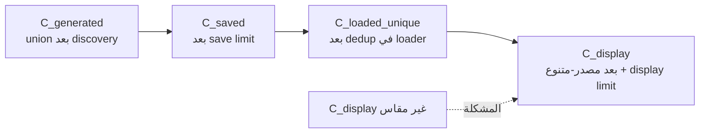
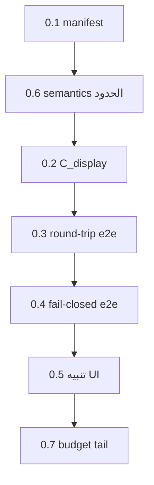

# خطة شاملة لتحسين الـ Matching في Excel Target عبر المراجعة اليدوية

> **لمن سينفّذ الخطة:** اتبع ممارسات TDD في المستودع و systematic-debugging. نفّذ
> المهام بالترتيب، وكل مهمة يجب أن تكون قابلة للاختبار بشكل مستقل.
> **اللغة:** التوثيق بالعربية، الأوامر/الرموز بالإنجليزية.

**الهدف:** الانتقال بالـ Excel-target manual-review من «إصلاح حالات مفردة» إلى
حلقة تحسين مقاسة ومقيدة: (1) إغلاق بوابات الأمان/القياس المتبقية، (2) قياس
candidate recall وprecision على gold set حقي، (3) تفعيل قنوات الاستدعاء
الإضافية خلف flags بعد replay مقارن، (4) إغلاق فجوات الـ parsing التي تمنع
المرشح الصحيح من الظهور بـ provenance سليم، وكل ذلك **دون أي توسعة غير مراجَعة
للمطابقة التلقائية**.

**الحالة الراهنة (تحقق فعلي من الكود والاختبارات):** المهام `review_identity`,
`review_identity_prefix`, `cross_language_alias`, `ranking_tier`, أدوات
`report_excel_target_candidate_coverage.py` و`evaluate_excel_target.py` **مطبّقة
وملتزمة** في `feature/excel-target-source`. آخر commit:
`0e84fdc feat: add gated cross-language review discovery`. مجموعة الاختبارات
`tests/core/excel_target` + `tests/core/manual_review/test_manual_review_candidates.py`
تُنتج حالياً: **179 passed, 2 subtests passed**.

**المرجع (Spec):** `01-evidence-and-root-causes.md`, `06-candidate-recall-code-map.md`,
`07-baseline-data-analysis.md`, `08-test-and-metrics-strategy.md`,
`16-phase2-candidate-coverage-plan.md`, `19-precision-sampling-report.md`,
`20-task4-review-and-rollout-gates.md`, `24-gate0-full-replay-results.md`,
`25-fail-closed-safety-review.md`, `26-c-display-measurement-design.md`,
`27-gated-cross-language-review-discovery.md`.

**Tech Stack:** Python 3.11، dataclasses، normalization مستقل عن RapidFuzz،
loader/matcher الحالي، JSONL/CSV artifacts، pytest/unittest، Streamlit UI، SQLite
(read-only في الاختبارات).

---

## القسم 1: تقييم الوضع الحالي (المنجز مقابل الناقص)

### 1.1 ما تم إنجازه فعلياً (تحقق من الكود)

| القدرة | الملف | الدليل |
|---|---|---|
| تطبيع brand خاص بالمراجعة | `excel_target_identity.py:384` | `normalize_arabic_review_brand` موجودة ومختبرة |
| دالة استدعاء review-only | `excel_target_identity.py:297` | `identify_review_candidates` |
| نوع دليل صريح | `excel_target_identity.py:29-31` | `review_identity`, `review_identity_prefix` |
| دمج المرشحين للمراجعة فقط | `excel_target_matching.py:131-132` | `review_identified` يغذّي `build_review_candidates` |
| حاجز automatic fail-closed | `excel_target_matching.py:215-218` | رفض `review_identity`/`review_identity_prefix`/`review_fuzzy` |
| cross-language alias channel | `excel_target_review_discovery.py:31-32,200-204` | `cross_language_alias` خلف flag |
| ترتيب بالـ tier | `excel_target_review_candidates.py:125-134` | tier 0..4 |
| segment persistence | `excel_target_review_candidates.py:411-414` | `candidate_method` لكل evidence kind |
| report أداة read-only | `tools/report_excel_target_candidate_coverage.py` | قابلة لـ `--labels` |
| gold set fixture | `tests/core/excel_target/fixtures/gold_labels.csv` | 6 صفوف عامة |
| feature flag | `config_models.py:107-108` | `excel_target_review_cross_language_aliases_enabled=False` |

### 1.2 ما هو ناقص أو مفتوح (من المراجعات المستقلة)

1. **Gate 0 غير مغلق** (`20-task4-review-and-rollout-gates.md`, `24-gate0-full-replay-results.md`):
   - `C_display` غير مقاس فعلياً (التقرير يعتمد fallback على `candidate_count`).
   - round-trip `JSONL → loader → UI merge` غير مغطى بـ e2e مع صفَّين نفس الهوية وrow keys مختلفة.
   - fail-closed غير مغطى من `ExcelTargetMatcher.match` حتى `best_match` عبر e2e.
   - تنبيه `Review-only` في UI (`streamlit_manual_review_page.py:454-457,674`) يعرض فقط `review_fuzzy`، لا كل review-only kinds (نتيجة MEDIUM في `25-fail-closed-safety-review.md`).
2. **Precision غير مقاس** (`19-precision-sampling-report.md`): يوجد إطار labeling `P/N/U/E` وعينة audit بمقدار 23 مرشح، لكن لا labels فعلية مسجّلة بعد.
3. **candidate tail ارتفع**: p99 من 3→8، max من 4→11 في البركة (`19-precision-sampling-report.md:53`). يحتاج budget معلن.
4. **cross-language flag لم يُفعّل**: replay تشغيله مقصود ومؤجل (`16-phase2-candidate-coverage-plan.md`, Task 5/6).
5. **فجوة parsing للرموز الملتصقة** (`06-candidate-recall-code-map.md` H3): `3AMP`, `3مبول` لا تُفك attributes كما المفصولة بمسافة؛ والصف الصحيح يظهر `candidate pack/strength is not proven`، وهذا يمنعه من أن يصبح automatic حتى بعد recall.
6. **`store_candidates: false`**: `run_candidates` فارغ في DB، ما يقيّد التحليل على artifacts فقط.
7. **`NameError` محتمل في `test_baraka_safe_matching.py`** ذُكر في `25-...md:156-159`؛ لم يعد يظهر في التشغيل الحالي 179-pass، لكن يبقى يجب تأكيد استقراره.

---

<!-- SECTIONS_APPENDED_BELOW -->
## القسم 2: القيود العامة (Global Constraints)

- **الهوية/المطابقة التلقائية مستقرّة**: أي دليل review-only (`review_identity`,
  `review_identity_prefix`, `review_fuzzy`, `english_fuzzy`, `arabic_fuzzy`,
  `cross_language_alias`, `cohere_translation`, `cached_cohere`, أي نوع مستقبلي)
  **لا يمكن أن ينتج `best_match` أو auto-save**. الـ allowlist `_AUTOMATIC_IDENTITY_KINDS`
  يبقى الحاجز، وأي نوع جديد يفشل مغلقاً حتى يُراجَع صراحة.
- **`normalize_arabic_brand` التلقائي لا يتغير**. أي تعديل في الـ parsing يكون في
  مسار منفصل وله test مستقل.
- **الحدود الثلاثة منفصلة دائماً**: `C_generated` (union بعد discovery limit),
  `C_saved` (بعد save limit)، `C_display` (بعد UI merge/dedup/display limit).
  الـ invariant: `0 <= C_display <= C_saved <= C_generated`.
- **كل مرشح محفوظ يحتفظ بـ**: `target_key`, `source_file`, `source_row_number`,
  `excel_target_row_key`, `candidate_method`, `ranking_tier`, `score_margin`,
  `compatibility_status`, `compatibility_rejection`.
- **لا شبكة/لا Cohere/لا Tawreed API** من أي قناة review-only جديدة.
- **الحتمية**: نفس catalog + config + input ⇒ نفس ترتيب `(row_key, score,
  candidate_method, ranking_tier, review_status, rejection_reason)`.
- **الاختبارات**: في الذاكرة أو temp fixtures؛ لا تلمس `state/*.db` أو
  workbooks في unit tests.
- **حفظ تغييرات المستخدم**: لا `git checkout`/`reset`/`clean` على
  `src/core/excel_target`, `tests/core/excel_target`, `state`, أو input workbooks.
- **الـ replay التشغيلي** يكتب artifacts/state: سجّل run dir، وقارن الحقول
  الدلالية لا الوقت/run id.

---

## القسم 3: خريطة الملفات (File Map)

- `src/core/excel_target/excel_target_identity.py`: التطبيع، فهرس الهوية،
  `identify`, `identify_review_candidates`.
- `src/core/excel_target/excel_target_matching.py`: بوابة الأمان، دمج المرشحين،
  `_compatible_identified`, `_identity_decision`.
- `src/core/excel_target/excel_target_review_candidates.py`: tiers، الترتيب،
  dedup، row key، serialization.
- `src/core/excel_target/excel_target_review_discovery.py`: القنوات المقيّدة
  (english_fuzzy, arabic_fuzzy, cross_language_alias).
- `src/core/excel_target/product_attributes.py`: form/strength/pack/concentration
  parsing (فجوة الرموز الملتصقة).
- `src/cli/commands/cli_order_excel_target.py`: counts، artifacts، write path.
- `src/core/manual_review/manual_review_candidates.py` + `..._store.py`:
  round-trip للـ options.
- `src/ui/manual_review/streamlit_manual_review_page.py`: dedup، display limit،
  provenance، تنبيه review-only.
- `src/core/config_models.py`: typed flags/limits.
- `tools/report_excel_target_candidate_coverage.py`,
  `scripts/evaluate_excel_target.py`, `scripts/baraka_coverage_report.py`: أدوات
  القياس.
- `tests/core/excel_target/*`, `tests/cli/commands/test_excel_target_*.py`,
  `tests/ui/manual_review/test_streamlit_manual_review.py`,
  `tests/tools/test_report_excel_target_candidate_coverage.py`: الاختبارات.
- `tests/core/excel_target/fixtures/gold_labels.csv`: gold seed.
---

## القسم 4: مراحل التنفيذ (Phases & Tasks)

الترتيب إلزامي: كل مرحلة تبني على سابقتها. لا تبدأ Phase 3 قبل إغلاق Phase 1.

### Phase 0 — تثبيت خط الأساس وإغلاق Gate 0

**الهدف:** جعل القياس والسلامة قابلة للتدقيق قبل أي توسعة.

- [ ] **0.1 manifest قبل التشغيل.** أنشئ `tools/excel_target_replay_manifest.py`
  (read-only، يكتب JSON فقط) يسجّل: `git_sha`, `working_tree_patch_sha256`,
  `python_version`, `config_sha256`, `order_workbook_sha256`,
  `baraka_workbook_sha256`, `kaisr_workbook_sha256`, `prevented_workbook_sha256`,
  `manual_review_db_sha256`, `order_runs_db_sha256`, `target_catalog_fingerprint`
  (من صفوف canonicalized لا mtime), `command_line`, `run_id`. اختبار يثبت عدم
  الكتابة في SQLite/workbooks (patch أي `upsert`/`commit` ليُفشل).
- [ ] **0.2 قياس `C_display` الحقي.** نفّذ تصميم `26-c-display-measurement-design.md`:
  harness read-only يستدعي مسار `render_run_candidates` الحقي ويراقب الحدّ عند
  `_render_item_card`. أنشئ `tests/ui/manual_review/test_streamlit_display_measurement.py`
  مع Acceptance 1–9 من ملف 26. النتيجة `status=measured` أو `not_measured`، وممنوع
  fallback `candidate_count` كـ displayed.
- [ ] **0.3 round-trip e2e.** اختبار: خياران بنفس product id/name/source/target
  وrow key مختلفان → writer → `load_review_candidates` → `_load_group_candidates`
  → merge. يجب أن يبقى الخياران، وأن يمرّ `ranking_tier`, `candidate_method`,
  `score_margin`, وكل provenance دون فقد.
- [ ] **0.4 fail-closed e2e.** اختبار يمرر evidence مجهول/`discovery_only` داخل
  `ExcelTargetMatcher.match` الكامل، ويؤكد `decision.best_match is None` وعدم
  `auto-save`/`rebind`، لكل kind من قائمة `25-...md` §D. أضف كذلك اختبار أن
  trusted native/dictionary ما زال ينتج match (منع تحوّل الحاجز لتعطيل شامل).
- [ ] **0.5 توحيد تنبيه UI review-only.** عدّل
  `streamlit_manual_review_page.py` ليعرض عبارة `Review-only` لكل
  evidence kind في مجموعة review-only (وليس `review_fuzzy` فقط)، وفق `25-...md` §5.
  اختبار UI يثبت ظهور التنبيه لكل kind.
- [ ] **0.6 semantics موحّدة للحدود.** وحّد تعامل `0`/السالب/غير الصالح بين
  `_review_candidate_limit` (الذي يحوّل 0→1 عبر `max(1,...)`)، وcoverage report،
  وUI. اختبار matrix للحدود، مع أسماء الحدود في التقرير.
- [ ] **0.7 budget معلن للـ tail.** عرّف في config/document صريحاً budget
  لـ p95/p99/max لـ `C_generated` و`C_saved` (الافتراضي: p99 ≤ 10، max ≤ 25
  لكل target) وfailing threshold في التقرير.

**Verification:**
```powershell
& '.venv\Scripts\python.exe' -m pytest tests\core\excel_target tests\core\manual_review\test_manual_review_candidates.py tests\cli\commands\test_excel_target_manual_review_artifacts.py tests\ui\manual_review\test_streamlit_manual_review.py tests\tools\test_report_excel_target_candidate_coverage.py -q
```

**Exit Gate:** كل invariants صحيحة، `C_display` مقاس، round-trip لا يفقد شيئاً،
fail-closed مُثبت e2e.

> **شرح تفصيلي لـ Phase 0 مع أمثلة:** انظر «الملحق A» أسفل المستند.

### Phase 1 — تصنيف gold set وقياس precision/recall

**الهدف:** تحويل إطار `19-precision-sampling-report.md` إلى labels فعلية.

- [ ] **1.1 gold file ثري.** وسّع `tests/core/excel_target/fixtures/gold_labels.csv`
  إلى schema الموصوف في `08-...md` §4.1:
  `item_code,item_name,target_key,expected_row_key,expected_store_product_id,label,expected_category`.
  أضف الصفين الموجبين `VOLTAREN 3AMP`→row 3100 و`XITHRONE 500MG 3TAB`→row 2345
  مع row key الفعلي، وكل near-negatives (§4.1: 3/6 أمبول، 3/5 أقراص، syrup مقابل
  tablet، strength مختلف، unrelated numeric overlap).
- [ ] **1.2 labels CSV للمراجعة البشرية.** أنشئ
  `tests/core/excel_target/fixtures/reviewed_labels_audit.csv` بصفوف الـ audit set
  الخمس (23 مرشحاً من `19-...md:138-144`)، وأعمدة `label ∈ {P,N_variant,N_prefix,U,E_stale}`.
  أضف reviewer/adjudication/time docs.
- [ ] **1.3 توسيع evaluator.** عدّل `scripts/evaluate_excel_target.py` و/أو
  `tools/report_excel_target_candidate_coverage.py` ليحسب: `recall_universe`,
  `recall_saved`, `recall@1/@3/@5`, `precision_labeled` لكل `candidate_method`،
  وفصل `U` عن `N`. لا يستخدم score/compatibility بدل label.
- [ ] **1.4 Wilson/exact interval** بعد وجود labels، وممنوع interval مبني على score.
- [ ] **1.5 تعزيز report tool** ليفشل عند count inconsistencies، ويكشف duplicate
  item records، ولا يسمّي saved بأنه displayed.

**Verification:** تشغيل الـ report على snapshot `20260910_1243` مع ملفات labels،
وإنتاج precision/recall بأرقام ومقامات ومعدلات.

**Exit Gate:** gold row keys مُثبتة، precision_labeled محسوبة، لا safety/data-quality
errors.

### Phase 2 — إغلاق فجوة parsing والرموز الملتصقة

**الهدف:** بعد recall الصحيح، يجب أن يحمل المرشح الصحيح attributes مُثبتة بقدر
الممكن، مع بقاء automatic مغلقاً حتى تثبت كل attributes.

- [ ] **2.1 اختبارات فاشلة أولاً** في `tests/core/excel_target/test_product_attributes.py`
  للحالات: `3AMP`, `3 AMP`, `3AMPS`, `3امبول`, `3 امبول`, `3مبول`, `6AMP`,
  `5قرص`, syrup مقابل tablet، وstrength مفقود.
- [ ] **2.2 توسيع جدول forms/pack** في `product_attributes.py` ليشمل الصيغ
  المختصرة `مبول` والملتصقة `3AMP` (عبر regex يسمح بلا مسافة) دون كسر `_has_alias`'s
  `\b` للحالات المفصولة.
- [ ] **2.3 تأكيد عدم تسرب للـ automatic:** اختبار أن `VOLTAREN 3AMP` مع row 3100
  يبقى review-only بـ `candidate pack is not proven` → بعد الإصلاح يصبح attribute
  مُثبتاً **لكن لا يصبح automatic** إلا إذا اشترطت سياسة الـ compatibility صفاً
  وحيداً متوافقاً (اختبار صريح للسلوك المطلوب، وتوثيقه إن تغيّر).
- [ ] **2.4 نفس الشيء لـ `XITHRONE 500MG 3TAB`** وrow 2345 (`candidate strength is not proven`).

**Exit Gate:** parsing يثبت form/pack للأمثلة الصحيحة، ولا false auto-match،
والـ near-negatives (6AMP/5TAB) لا ترث نفس attributes.

### Phase 3 — تفعيل قنوات review-only خلف flags بعد replay

**الهدف:** تشغيل القنوات الجديدة على بيانات حقيقية بعد إثبات القياس.

- [ ] **3.1 replay قبل التفعيل.** شغّل الأمر التشغيلي (من
  `10-before-after-runbook.md`) بنفس input/config/targets/limit/workers/flags.
  سجّل `artifacts/order/wardany/<run>`.
- [ ] **3.2 مقارنة بالـ manifest.** استخدم `scripts/evaluate_excel_target.py`
  بمخرجات before/after + gold labels، وافشل عند gold failure أو safety/data-quality
  error أو matched-set change غير مفسر.
- [ ] **3.3 تفعيل `cross_language_aliases_enabled`** في `state/config.yaml` بعد
  PASS فقط، وبنفس الـ commit الذي قيس.
- [ ] **3.4 إثبات rollback.** اختبار أنه بعكس الـ flag يعود السلوك السابق بالضبط.
- [ ] **3.5 تأكيد أن automatic matched set لا يزيد** بسبب أي قناة review-only.

**Exit Gate:** replay مقارن PASS، tail داخل budget، automatic unchanged.

### Phase 4 — حلقة التحسين المستمرة

**الهدف:** جعل المراجعة اليدوية تغذّي تحسيناً مقاساً ومحدوداً.

- [ ] **4.1 تتبع مصدر الرفض.** عند كل manual approval، سجّل في
  learning/audit record: `coverage_category` الأصلي، `compatibility_rejection`,
  `candidate_method`, `ranking_tier`, وrow key.
- [ ] **4.2 تقرير جذور متكررة.** أداة read-only تجمّع أسباب عدم المطابقة
  (normalization، parsing، alias مفقود، variant conflict) وترتّبها بالتكرار.
- [ ] **4.3 اقتراحات alias/nullable بمصادر مراجَعة.** أي تحسين مقترح (alias جديد،
  تعديل normalization) يمرّ عبر gold + replay + safety قبل التفعيل
  (وفق `05-deterministic-alias-proposals.md`).
- [ ] **4.4 تحديث README/الـ runbook** بأرقام before/after لكل target.

**Exit Gate:** حلقة موثّقة، لا تحسين غير مقاس، ولا توسعة automatic غير مراجَعة.
---

## القسم 5: بوابات القبول (Acceptance Gates)

### Gate A — قياس وحدود
```text
0 <= C_display <= C_saved <= C_generated
manual_review_required == (C_generated > 0)
candidate_count_saved == len(options) لكل سجل JSONL
لا fallback صامت من saved إلى displayed
semantics موحّدة للحدود (0/سالب/غير صالح) بين CLI/report/UI
```

### Gate B — provenance وround-trip
```text
كل option يحلّ إلى صف في catalog الهدف المحدد
صفّان بنفس product id/name وrow keys مختلفة يبقيان مستقلين بعد writer→store→UI
round-trip يحفظ ranking_tier وcandidate_method وscore_margin وprovenance
لا تسرّب source من Tawreed أو target آخر
```

### Gate C — عزل review-only (fail-closed)
لكل kind من: `review_identity`, `review_identity_prefix`, `review_fuzzy`,
`english_fuzzy`, `arabic_fuzzy`, `cross_language_alias`, `cohere_translation`,
`unknown/discovery_only`:
```text
decision.best_match is None
لا auto-save ولا rebind
trusted native/dictionary identity ما زال ينتج match (لا تعطيل شامل)
automatic matched set لا يزيد بسبب أي review-only evidence
```

### Gate D — recall/precision
```text
correct_row_recall_after == 1.0 للصفين 3100 و 2345
correct_row_recall_after >= correct_row_recall_before
precision_labeled مُبلغ لكل method، و U لا يُحسب negative
gold row keys لا تختفي من C_universe
```

### Gate E — deterministic وbudget
```text
نفس (row_key, score, candidate_method, ranking_tier, review_status, rejection_reason) عبر إعادتين
نفس النتيجة بـ workers=1 و workers=4
p95/p99/max للـ C_generated/C_saved داخل الـ budget المعلن
saved_set tidak يتغير بسبب ترتيب قراءة ملفات JSONL
```

**قرار النشر:** PASS / CONDITIONAL / FAIL وفق `08-...md` §11.
المكسب الأساسي هو `automatic_gain = automatic_verified_after - automatic_verified_before`.
`approved_manual_override` تُبلّغ منفصلة ولا تُحسب مكسباً.

---

## القسم 6: نموذج تقرير النتيجة

لكل target ثم aggregate:
```text
run_id / git_sha / config_sha256 / catalog_fingerprint
input_count_before_filter / input_count_after_filter
gold_positive_count / gold_out_of_scope_count
recall_universe / recall_saved / recall_at_1 / recall_at_3 / recall_at_5
precision_labeled (لكل candidate_method، مع P/N/U/E)
candidate_count_generated: mean/p50/p95/p99/max
candidate_count_saved:     mean/p50/p95/p99/max
candidate_count_displayed: mean/p50/p95/p99/max  (status=measured|not_measured)
automatic_verified_before / after / automatic_gain
approved_manual_override_before / after (informational)
matched_set_changed_count
safety_errors / data_quality_errors / gold_failures
index_build_ms / match_total_ms / match_p50_ms / match_p95_ms / timeout_count
semantic_determinism_hash_equal
manual_review_db_hash_equal / order_runs_db_hash_equal
artifact_paths / artifact_sha256
```

---

## القسم 7: أوامر التحقق المرجعية

**وحدات مركزة (بعد كل مهمة):**
```powershell
& '.venv\Scripts\python.exe' -m pytest tests\core\excel_target -q
& '.venv\Scripts\python.exe' -m pytest tests\cli\commands\test_excel_target_e2e.py tests\cli\commands\test_excel_target_manual_review_artifacts.py -q
& '.venv\Scripts\python.exe' -m pytest tests\ui\manual_review\test_streamlit_manual_review.py tests\tools\test_report_excel_target_candidate_coverage.py -q
```

**فحوصات ثابتة:**
```powershell
& '.venv\Scripts\python.exe' tools\rule_audit.py
git diff --check
git status --short
```

**replay تشغيلي (Phase 3 فقط):** الأمر من `10-before-after-runbook.md:41-44` بنفس
flags، على sandbox/state معزول، مع manifest.

---

## القسم 8: المخاطر والتخفيف

| الخطر | الأثر | التخفيف |
|---|---|---|
| `--limit 100` لا يحتوي VOLTAREN/XITHRONE | recall يبدو صفراً زوراً | preflight يثبت membership، ثم focused/full replay |
| catalog تغيّر بين before/after | row key غير قابل للمقارنة | fingerprint، وإبطال عند drift |
| تقييس review-only في UI يوحي بأنه verified | قرار بشري خاطئ | تنبيه `Review-only` لكل kind (Phase 0.5) |
| parsing توسّع كثيراً | false attributes / auto-match خاطئ | near-negatives، وإبقاء الحاجز fail-closed |
| candidate tail ينفجر | إغراق المراجع | budget معلن، p95/p99 gate |
| labels غير مستقلة | precision متفائل | مراجعان + adjudication + توثيق provenance |
| DB writes أثناء القياس | baseline ملوّث | sandbox DB hashes، patch store، `use_saved_approvals=False` |
| dirty worktree | سبب التحسن غير معروف | manifest SHA/patch/config |

---

## القسم 9: البدائل المرفوضة

- **رفع `manual_review_save_candidate_limit` وحده**: الصف الصحيح لم يكن يدخل
  `review_candidates` أصلاً (`06-...md`, `07-...md`).
- **معاملة الصفوف العربية كمرشحات إنجليزية fuzzy**: يخرق الحد ثنائي اللغة
  ويفتح مصدراً بلا مرساة هوية (`11-plan-review.md`).
- **ترقية توسعة review-only إلى المطابقة التلقائية**: تحوّل إصلاح recall إلى
  تغيير سياسة مطابقة غير مراجَع.
- **استثناء صلب باسمَي `VOLTAREN`/`XITHRONE`**: يحلّ صفّين دون تحسين المسار العام.
- **تفعيل cross-language flag قبل replay**: يخرق `16-...md` Task 5/6 و`24-...md`.
- **خفض thresholds fuzzy لتوسيع recall**: يُغرق المراجع ويرفع false positives
  (`08-...md` §5.2).
- **الاعتماد على `candidate_count` كـ displayed**: يخلط saved بـ displayed
  (`20-...md` §5, `26-...md`).
- **استخدام score/compatibility كـ gold label**: يحوّل القياس إلى اختبار لنفس القاعدة
  (`19-...md:130`).

---

## القسم 10: معايير الإنجاز النهائية

المشروع يُعتبر «أفضل» عندما تتحقق كل البنود:

1. Gate A–E كلها PASS.
2. gold row keys للصفين 3100 و2345 داخل `C_generated` و`C_saved` و`C_display`.
3. `C_display` مقاس فعلياً بـ harness UI، وليس مُستنتجاً.
4. precision_labeled محسوبة على عينة موثّقة، وtail داخل budget معلن.
5. cross-language flag مفعّل بعد replay مقارن، مع rollback مُختبر.
6. automatic matched set لم يتغير بسبب أي review-only evidence.
7. round-trip لا يفقد أي provenance أو tier.
8. حلقة التحسين (Phase 4) موثّقة وتغذّي تحسينات مقاسة فقط.
---

## الملحق A: شرح تفصيلي لـ Phase 0 مع أمثلة

هذا الملحق يشرح كل بند من Phase 0: **المشكلة الحالية بالضبط** (من الكود الفعلي)،
**المطلوب**، و**مثال توضيحي** قابل للنسخ.

### A.0 لماذا Phase 0 أولاً؟

لأن كل تحسين لاحق (gold labels، تفعيل cross-language، تعديل parsing) يحتاج
«مسطرة» موثوقة. حالياً المسطرة ناقصة: لا نقيس `C_display` فعلياً، ولا نثبت أن
الـ round-trip لا يُسقط صفوفاً، ولا نثبت fail-closed من طرف واحد. بدون ذلك أي
«تحسّن» في recall قد يكون وهمياً (زيادة سجلات محفوظة لا زيادة استدعاء صحيح).



---

### A.1 manifest قبل التشغيل

**المشكلة:** أي replay حالي غير قابل للمقارنة بأمان، لأننا لا نعرف `git_sha`
ولا hash الـ workbooks/config. لو تغيّر `محروس1.xlsx` بين before/after تصبح كل
row keys غير قابلة للمقارنة، ولا نعرف أن السبب هو catalog drift لا الكود.

**المطلوب:** أداة read-only تكتب JSON واحد قبل كل replay.

**مثال توضيحي (`tools/excel_target_replay_manifest.py` — هيكل متوقع):**

```python
def build_manifest(*, config_path, order_xlsx, catalog_xlsx, db_paths, run_id):
    def sha(p):
        return hashlib.sha256(Path(p).read_bytes()).hexdigest().upper() if Path(p).exists() else None
    return {
        "git_sha": _git("rev-parse", "HEAD"),
        "config_sha256": sha(config_path),
        "order_workbook_sha256": sha(order_xlsx),
        "catalog_workbook_sha256": sha(catalog_xlsx),
        "manual_review_db_sha256": sha(db_paths["manual_review"]),
        "target_catalog_fingerprint": _catalog_fingerprint(catalog_xlsx),  # صفوف canonicalized
        "run_id": run_id,
    }
```

**قيمة فعلية معروفة (من `07-baseline-data-analysis.md:168`):**
`محروس1.xlsx` = `CC50AC5833483105C620D62CE820166F93BCC985405ACD8B9430FD2ABE6F7`.
لو الـ manifest بعد التغيير يعطي hash مختلف → المقارنة تُلغى (`catalog_drift`).

**الاختبار الحاجز:** monkeypatch كل مسارات الكتابة (`upsert`, `commit`,
`execute_update`) لتُفشل الاختبار إن استُدعيت، ثم تأكيد `sha256` لملفات
`state/*.db` قبل/بعد متطابق.

---

### A.2 قياس C_display الحقي

**المشكلة الحقيقية (من الكود):** مسار UI يقلّص الخيارات مرتين:

```python
# src/ui/manual_review/streamlit_manual_review_page.py:226-241
candidates_dict = _load_group_candidates(run_dirs)          # merge + dedup
display_limit = _candidate_display_limit(app_config)
display_items = _filter_and_prepare_items(candidates_dict, store, hide_completed)
page_items = _paginate_candidates(display_items)             # 50/صفحة
for item_key, options in page_items:
    visible_options = _limit_candidates_by_source(options, display_limit)
    _render_item_card(item_key, item, visible_options, run_context, store)
```

و`_limit_candidates_by_source` (السطر 317) **تضمن تنوعاً مصدرياً**: تأخذ أول
خيار من كل source قبل أن تكمّل بالحد. لذلك `C_display` قد تكون **أصغر** من
`C_saved`، وقد تُسقط خيارات. لا يمكن حسابها من JSONL، بل من لحظة الوصول إلى
`_render_item_card`.

**المطلوب:** harness read-only يستدعي المسار الحقي ويراقب عند `_render_item_card`
دون أي كتابة. بناءً على `26-c-display-measurement-design.md`.

**مثال توضيحي:**

```python
captured = []

def capture_item_card(item_key, item, visible_options, run_context, store):
    captured.append({
        "item_key": item_key,
        "row_keys": [o.excel_target_row_key for o in visible_options],
        "methods": [o.candidate_method for o in visible_options],
        "count": len(visible_options),
    })

with patch.object(page, "manual_review_store_or_stop", return_value=ReadOnlyStore()):
    with patch.object(page, "_render_item_card", side_effect=capture_item_card):
        page.render_run_candidates(run_dirs, app_config)

c_display_run = sum(c["count"] for c in captured)   # الحقيقة، لا fallback
```

**مثال رقمي (مهم):** لنفترض item له 8 خيارات في `C_generated`، وsave limit = 3،
وdisplay limit = 2، والخيارات موزّعة على مصدرين (excel-target + legacy):

| المرحلة | القيمة | السبب |
|---|---:|---|
| `C_generated` | 8 | union بعد discovery limit |
| `C_saved` | 3 | `manual_review_save_candidate_limit=3` |
| `C_loaded_unique` | 3 | لا dedup إضافي (row keys مختلفة) |
| `C_display` | 2 | `_limit_candidates_by_source(visible, 2)` |

**الخطر الحالي:** التقرير يُظهر `C_display == C_saved` لأنه يستخدم
`candidate_count` كـ fallback. هذا خطأ. القاعدة: إن لم نلتقط نداء
`_render_item_card`، تكون النتيجة `status = "not_measured"`، ولا يُنسخ
`C_saved` مكانها.

**الاختبار الحاجز (Acceptance 5 من ملف 26):** خياران بنفس product identity
وrow keys `row-a`/`row-b` يجب أن يظهرا **كلاهما** في `captured` — أي أن الـ dedup
لا يُسقط صف Excel حقيقياً مختلفاً.

---

### A.3 round-trip e2e (JSONL → loader → UI merge)

**المشكلة الحقيقية (من الكود):** عند القراءة، هوية الدمج في `_load_group_candidates`
(السطر 256-265) **تضمن** `excel_target_row_key` حالياً، وهذا جيد. لكن يجب إثبات
أنه لا يسقط صفوفاً عبر `load_review_candidates` ثم `from_dict`. المشكلة المستقبلية:
لو حقل غير معروف (`ranking_tier`) أُسقط في `from_dict` (راجع `ReviewCandidateOption`
السطر 56 → يجب أن يُبقي الحقل).

**المطلوب:** اختبار يشغّل السلسلة الكاملة على fixture فيه صفان نفس الهوية وrow
keys مختلفة.

**مثال توضيحي:**

```python
def test_roundtrip_keeps_two_physical_rows(tmp_path):
    # صفان: نفس product id/name/source/target، لكن source_row 3100 و 3101
    opt_a = _option(row_key="rk-3100", source_row=3100, ranking_tier=2)
    opt_b = _option(row_key="rk-3101", source_row=3101, ranking_tier=3)
    _write_jsonl(tmp_path, item_key="vol3::VOLTAREN 3AMP", options=[opt_a, opt_b])

    loaded = load_review_candidates(tmp_path)                    # JSONL → model
    merged = _load_group_candidates([tmp_path])                  # UI merge

    got = merged["vol3::VOLTAREN 3AMP"]
    assert [o.excel_target_row_key for o in got] == ["rk-3100", "rk-3101"]
    assert got[0].ranking_tier == 2 and got[1].ranking_tier == 3  # لا فقد للحقل
    assert got[0].candidate_method and got[0].score_margin is not None
```

**الفكرة:** لو دمج الـ UI يعتمد على `(product_id, name, source)` فقط دون row key،
فسيبقى خيار واحد فقط (خطأ). هذا الاختبار يجثّم أن الـ dedup **لا يحدث إلا عند
تساوي `excel_target_row_key`**.

---

### A.4 fail-closed e2e (من `match()` إلى `best_match`)

**المشكلة:** الحاجز الحالي في `_compatible_identified` (السطر 218-227) يرفض
`review_identity`/`review_identity_prefix`/`review_fuzzy` صراحةً، ويرفض أي نوع
خارج `_AUTOMATIC_IDENTITY_KINDS` (السطر 225). لكن لا يوجد اختبار يشغّل
`ExcelTargetMatcher.match` كاملاً ويؤكد أن evidence مجهول لا يصل إلى `best_match`.

**مثال توضيحي:**

```python
@pytest.mark.parametrize("kind", [
    "review_identity", "review_identity_prefix", "review_fuzzy",
    "english_fuzzy", "arabic_fuzzy", "cross_language_alias",
    "cohere_translation", "discovery_only", "unknown_future_kind",
])
def test_review_only_evidence_never_auto_matches(kind):
    # candidate يبدو متوافقاً ظاهرياً (نفس الاسم/القوة) لكن دليله review-only
    index = _FakeIndex(IdentifiedTarget(
        product=_product("فولتارين 3مبول س جديد", row=3100),
        evidence=IdentityEvidence(kind, "VOLTAREN", "synthetic", 0.9),
    ))
    matcher = ExcelTargetMatcher("البركة شركات", [..catalog..], identity_index=index)
    result = matcher.match(Item("vol3", "VOLTAREN 3AMP", 1))
    assert result.decision.best_match is None            # لا مطابقة تلقائية
    assert result.decision.decision_source is not MANUAL_REVIEW_SAVED  # لا rebind
```

**النصف الثاني من الحاجز (لا تعطيل شامل):**

```python
def test_trusted_native_identity_still_auto_matches():
    # evidence آمن (tawreed_catalog/dictionary) + توافق كامل → يجب أن يطابق
    ...
    assert result.decision.best_match is not None
```

**السبب:** لو أخطأ أحدهم لاحقاً وأضاف kind إلى `_AUTOMATIC_IDENTITY_KINDS` بالغلط،
هذه الاختبارات تفشل فوراً (fail-closed = الافتراضي آمن).

---

### A.5 توحيد تنبيه UI review-only

**المشكلة الحقيقية (من الكود):**

```python
# streamlit_manual_review_page.py:454-457
if option.identity_evidence_kind:
    details.append(f"Identity evidence: {option.identity_evidence_kind}")
if option.identity_evidence_kind == "review_fuzzy":          # ← الشرط الضيق
    details.append("Review-only fuzzy candidate; human approval required")
```

ويتكرر نفس الشرط في label (السطر 674). النتيجة: `review_identity`,
`review_identity_prefix`, `cross_language_alias`, `discovery_only` تظهر كخيارات
«موثوقة» بصرياً **دون** تحذير أن الموافقة البشرية مطلوبة. لا تُنتج مطابقة تلقائية،
لكنها خطر قرار بشري (MEDIUM في `25-...md`).

**المطلوب:** مجموعة review-only واحدة تُغطّي كل kinds.

**مثال توضيحي للإصلاح:**

```python
_REVIEW_ONLY_KINDS = {
    "review_identity", "review_identity_prefix", "review_fuzzy",
    "english_fuzzy", "arabic_fuzzy", "cross_language_alias", "cohere_translation",
}
...
if option.identity_evidence_kind in _REVIEW_ONLY_KINDS:
    details.append("Review-only candidate; human approval required")
```

**الاختبار الحاجز:**

```python
@pytest.mark.parametrize("kind", ["review_identity", "review_identity_prefix",
                                  "cross_language_alias"])
def test_provenance_caption_marks_every_review_only_kind(kind):
    caption = _render_candidate_provenance(_option(identity_evidence_kind=kind))
    assert "Review-only candidate" in caption
```

---

### A.6 semantics موحّدة للحدود

**المشكلة الحقيقية (من الكود):** تعامل غير متسق مع القيمة `0`:

| الموضع | الكود | سلوك `0` |
|---|---|---|
| CLI save limit | `cli_order_excel_target.py:563` → `max(1, int(value))` | `0 → 1` |
| UI display limit | `streamlit_manual_review_page.py:347` → `max(1, ...)` | `0 → 1` |
| baraka coverage | `baraka_coverage_report.py:160` → `max(0, ...)` | `0 → 0` |
| `_limit_candidates_by_source` | السطر 321 → `if limit <= 0: return []` | `0 → []` |

فنفس القيمة `0` تعني «1» في CLI و«اقفل» في التقرير. هذا يجعل المقارنة غامضة.

**المطلوب:** قرار واحد معلن. المقترح الآمن في هذا المستودع: **`0` يعني "معطّل"
(لا خيارات)**، لأن `_limit_candidates_by_source` يعمل بهذا المنطق أصلاً، ونتجنب
«1 خيار غير متوقع» عند خطأ config.

**مثال توضيحي:**

```python
# توحيد في config_models / helper واحد
def resolve_limit(value, *, default):
    try:
        v = int(value)
    except (TypeError, ValueError):
        return default
    return max(0, v)          # 0 = disabled, negative = invalid → default
```

**اختبار matrix:**

```python
@pytest.mark.parametrize("raw,expected", [
    (-5, "invalid_default"), (0, 0), (1, 1), (5, 5), ("abc", "invalid_default"),
])
def test_limit_semantics_are_uniform(raw, expected): ...
```

ويجب أن يُسمّى الحد بالاسم في التقرير حتى لا يُفهم `C_generated` كأنه universe كامل
بعد discovery limit.

---

### A.7 budget معلن للـ tail

**المشكلة الحقيقية (من `19-precision-sampling-report.md:53`):** بعد إضافة
`review_identity`, ارتفع حجم مجموعة المرشحين في البركة:

| | p50 | p95 | p99 | max |
|---|---:|---:|---:|---:|
| قبل (1457) | 1 | 2 | 3 | 4 |
| بعد (1243) | 2 | 4 | 8 | 11 |

الـ max ارتفع من 4 إلى 11، أي ~2.7x. لا يوجد سقف معلن، فلا نعرف هل هذا مقبول أم
إغراق للمراجع.

**المطلوب:** budget مكتوب صراحة + failing threshold في التقرير.

**مثال توضيحي (افتراضي مقترح):**

```yaml
# budget معلن في docs/config، ليس بالضرورة في state
candidate_tail_budget:
  target_key: "البركة شركات"
  p95_max: 6
  p99_max: 10
  absolute_max: 25
```

**منطق الفشل في التقرير:**

```python
def check_tail(dist, budget):
    failures = []
    if dist["p95"] > budget["p95_max"]: failures.append(f"p95 {dist['p95']} > {budget['p95_max']}")
    if dist["p99"] > budget["p99_max"]: failures.append(f"p99 {dist['p99']} > {budget['p99_max']}")
    if dist["max"] > budget["absolute_max"]: failures.append(f"max {dist['max']} > {budget['absolute_max']}")
    return failures                        # غير فارغة ⇒ CONDITIONAL/FAIL
```

**التطبيق على الأرقام أعلاه:** مع budget `p99_max=10, absolute_max=25`، الوضع
الحالي (p99=8, max=11) **يمرّ**. لكن لو صعد `max` إلى 30 بعد تفعيل cross-language،
يوجد الآن خط واضح يوقف الـ rollout بدل قرار انطباعي.

---

### A.8 ترتيب التنفيذ داخل Phase 0 (نصيحة عملية)



السبب: manifest أولاً (لأن كل قياس يبنى عليه)، ثم توحيد الحدود (لأن `C_display`
يعتمد عليها)، ثم القياس والاختبارات، وأخيراً الـ budget الذي يستخدم مخرجات
`C_generated`/`C_saved` بعد أن صارت موثوقة.

**معيار إنجاز Phase 0:** تشغيل الاختبارات المركزة أخضر + manifest لـ run حقي
مكتوب + تقرير `C_display` بحالة `measured` + صفر safety/data-quality errors.
