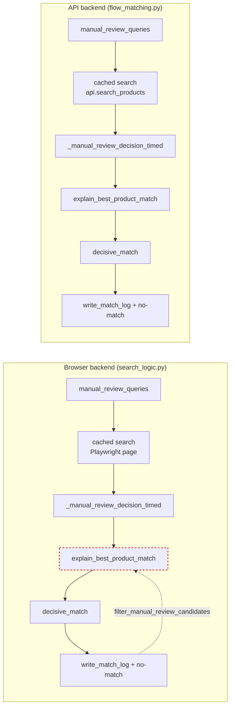
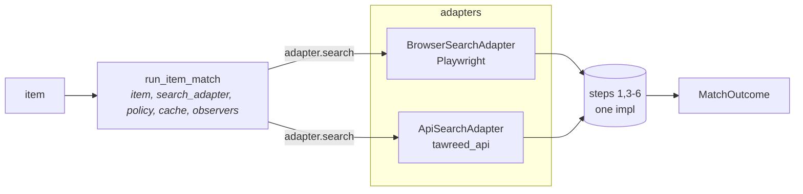

# C3 — One match loop, two search adapters

**Strength:** Strong
**Tag:** ports & adapters

## Files

- `src/tawreed/api/tawreed_api_flow_matching.py` (`require_api_match`)
- `src/tawreed/matching/tawreed_search_logic.py` (`require_product_match`, ~148 lines)
- Consumers: `src/tawreed/order/tawreed_order_match.py`, `tawreed_order_placement.py`, `src/tawreed/api/tawreed_api_flow_main.py`, `tawreed_api_flow_cart.py`

## Problem

The 6-step match-search protocol is copy-pasted between the API and browser backends:

1. `manual_review_queries(item, _search_queries_for_item(item), decision)`
2. Per-query cached search — API at `flow_matching.py:35`, browser at `search_logic.py:64`
3. `_manual_review_decision_timed` — identical function in both (`search_logic.py:81-89` ≡ `flow_matching.py:78-89`)
4. Manual-review forced match then `explain_best_product_match(item, ..., bot.config.matching)`
5. `decisive_match(bot, item, decision, ...)`
6. `write_match_log` + no-match handling with identical error strings (`"No decisive match found for '{item.name}' after {len(queries)} queries."`)

Only step 2's search mechanism varies (Playwright `search_products(bot, page, q)` vs `api.search_products(q)`) — i.e., the *only* genuine variation point is not a parameter; everything around it is duplicated. The copies have already drifted: the API copy lacks the `filter_manual_review_candidates` step that the browser copy has at `search_logic.py:99`.

The browser/API adapter seam exists conceptually (`execution_mode` in `tawreed_bot_api.py`), but the shared protocol is duplicated, so behaviour drifts independently.

## Solution

One `run_item_match(item, search_adapter, *, policy, cache, observers)` module — natural home `src/tawreed/matching/`, with `explain_best_product_match` staying in `src/core/matching`. Two adapters: `BrowserSearchAdapter(bot, page)` and `ApiSearchAdapter(api)`. `require_product_match` and `require_api_match` collapse to thin constructors of the adapter.

This depends on C2: parameterising `require_api_match(item, search, policy)` gives the search adapter its parameter slot. C2 makes C3 possible.

## Before / After

### Before — two parallel chains with the same 6 steps, drift already real

### After — one loop, the search is the only thing that varies

## Wins

- duplicated protocol becomes one implementation
- drift stops (the `filter_manual_review_candidates` gap closes)
- leverage: one interface, two adapters
- locality: protocol bugs fixed once, both backends benefit
- reads the seam: API vs browser is now the variation; today it is implicit in copy-paste
